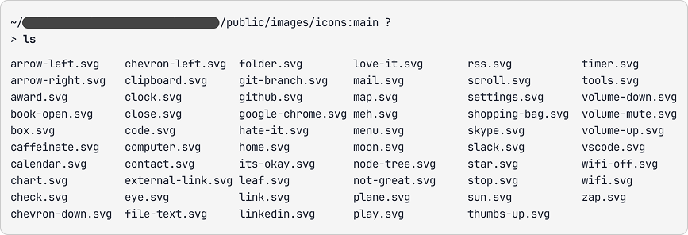

# lazy-icon-web-component

A web component lazy loading icons from individual sprites.

It uses the `IntersectionObserver` API to load the icon only when it is in the viewport. If the browser doesn't support this API, icon is loaded immediately.

## Setup

You'll need to expose your icons in a distant or local folder.



Each icon must be a well named file containing a `<svg>` sprite with a `<symbol>` identified by the id `icon`.

```html
<!-- /public/images/icons/arrow-left.svg -->
<svg
  xmlns="http://www.w3.org/2000/svg"
  xmlns:xlink="http://www.w3.org/1999/xlink"
  style="display: none"
>
  <symbol id="icon" viewBox="0 0 24 24">
    <path
      d="M7.828 11H20v2H7.828l5.364 5.364-1.414 1.414L4 12l7.778-7.778 1.414 1.414L7.828 11Z"
    />
  </symbol>
</svg>
```

## Usage

Copy this `lazy-icon.js` script inside your project.

Create the configuration object then insert bellow a `<script type="module"> anywhere in your HTML:

```html
<!doctype html>
<html>
  <head>
    <!-- head content -->
  </head>
  <body>
    <!-- body content -->

    <script>
      window.lazyIconConfig = {
        // spriteUrl can be a relative or absolute url
        spriteUrl: "/public/images/icons"
      };
    </script>
    <script src="./lazy-icon.js" type="module" async defer></script>
  </body>
</html>
```
